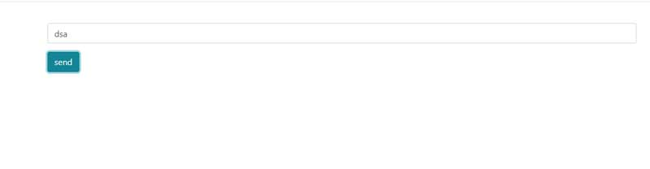

<a name="readme-top"></a>
<div align="center">

  
  <h1>php websocet </h1>
  
  <p>
پروژه PHP وب سوکت یک پروژه ساده برای ایجاد وب سوکت تحت زبان Php است.
<br>
توجه نمایید که این پروژه صرفاً تست است و برای نرم افزار چت آنلاین حرفه ایی 
نباید استفاده شود. 
اگر قصد دارید که از همین روش برای چت آنلاین استفاده کنید. 
میتوانید به آن ابزارهای امنیتی اضافه کنید.
  </p>

<!-- Badges -->
<p>
  <a href="https://github.com/samanbalahang/onlineChat/graphs/contributors">
    
  </a>
  <a href="https://github.com/samanbalahang/onlineChat/graphs/contributors">
    
  </a>
  <a href="https://github.com/samanbalahang/onlineChat/graphs/contributors">
    
  </a>
  <a href="https://github.com/samanbalahang/onlineChat/graphs/contributors">
    
  </a>
  <a href="https://github.com/samanbalahang/onlineChat/graphs/contributors">
    
  </a>
  <a href="https://github.com/samanbalahang/onlineChat/graphs/contributors">
    
  </a>
</p>
   
</div>

<br />

<!-- Table of Contents -->
<details>

<summary>

# :notebook_with_decorative_cover: Table of Contents

</summary>

- [About the Project](#star2-about-the-project)
  * [Folder Structure](#bangbang-folder-structure)
  * [Tech Stack](#space_invader-tech-stack)
- [Getting Started](#toolbox-getting-started)
  * [Installation](#gear-installation)
  * [Run Locally](#running-run-locally)
- [Contributing](#wave-contributing)
- [License](#warning-license)
- [Contact](#handshake-contact)
- [Acknowledgements](#gem-acknowledgements)

</details>  

<!-- About the Project -->
## :star2: About the Project

<div align="center">
  
</div>

<br />
این پروژه های Ratchat استفاده میکند و به شما امکان ایجاد یک چت آنلاین میدهد. ⏭

<!-- Folder Structure -->
### :bangbang: how to use


```bash
1- پروژه را دانلود کنید
2- دستورات زیر را اجرا کنید
    |composer install
    |composer update
3- فایل زیر را با  کمک زمپ یا دیگر سرورهای مجازی در مرورگر اجرا کنید
    | index.php
4- با کمک یک ترمینال فایل زیر را اجرا کنید
    |server.php
php server.php
or  php -S localhost:8000 -t onlineChat
5- در مرورگر خود متنی را در کادر ورود درج کنید و خروجی را مشاهده کنید            
```
<br />

<!-- License -->
## :warning: License

Distributed under the MIT License. See [LICENSE.txt](https://github.com/samanbalahang/onlineChat/blob/main/LICENSE) for more information.

<p align="right">(<a href="#readme-top">back to top</a>)</p>

<!-- Contact -->
## :handshake: Contact

SAMANA BALAHANG - [whatsapp number](009809224194485)
email: [saman.balahang.2012@gmail.com](mailto:saman.balahang.2012@gmail.com)

<p align="right">(<a href="#readme-top">back to top</a>)</p>

<!-- Acknowledgments -->
## :gem: Acknowledgements

This section used to mention useful resources and libraries that used in 3D Portfolio

 - [ratchat](http://socketo.me/)
 - [psr-4](https://www.php-fig.org/psr/psr-4/)

<p align="right">(<a href="#readme-top">back to top</a>)</p>
